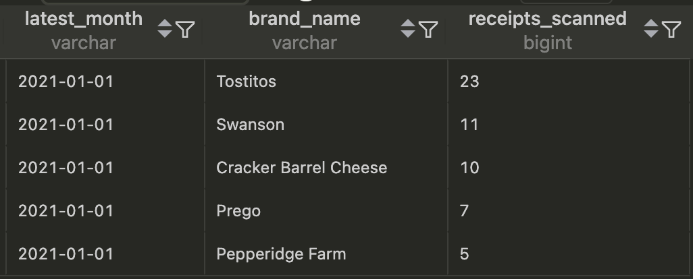
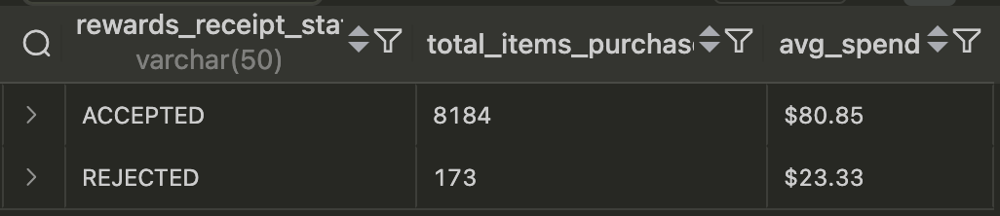

# Analytics Engineering Coding Challenge

## Overview
This project processes unstructured retail receipt data from JSON files into a structured relational data warehouse, addressing complex data quality challenges and enabling business critical analytics. This project involved cleaning and transforming multiple unstructured JSON datasets—specifically users, receipts, receipt items, and brands—to build a reliable, analysis-ready data pipeline. The main objectives were to:

- **Parse JSON Lines formatted files** while handling nested data.
- **Normalize and clean data** across multiple sources.
- **Address data quality issues** such as inconsistent schemas, missing values, and nested structures.
- **Build a relational data model** (evolving into a star schema) that can answer business-critical queries regarding brand performance, receipt statuses, and user behavior.
- **Document the entire process**, including challenges, solutions, and recommendations for future enhancements.

---

## Data Sources & Structure

The project worked with several JSON datasets containing complex, nested structures. Key characteristics include:

- **JSON Lines Format:**  
Each line in the files represents a separate JSON object. This format initially caused parsing issues when using `pd.read_json()` without the `lines=True` parameter.

- **Nested Fields:**  
    - **\_id:** Stored as `{"$oid": "value"}`  
    - **Date fields:** Nested as `{"$date": timestamp}`  
    - **cpg field (in brands):** Contains a nested structure with `$oid` and `$ref` keys.

- **Inconsistent Keys:**  
Some entries have missing keys (e.g., `brandCode` or `topBrand`), requiring additional checks to ensure data completeness.

---

## Data Quality Issues & Challenges

### Parsing Errors
- **Problem:**  
A `ValueError: Trailing data` occurred because the files were in JSON Lines format rather than a single JSON array.
- **Solution:**  
Use `lines=True` in `pd.read_json()` or parse the file line-by-line with `json.loads()`.

### Nested Data Handling
- **Example – `_id` Field:**  
Extract the UUID using:
```python
receipt = {'_id': entry['_id']['$oid']}
```
- **Example – `cpg` Field:**
Extract both the $oid and $ref keys:
```python
cpg = entry.get('cpg', {})
        brand['cpg_id'] = cpg.get('$id', {}).get('$oid')
        brand['cpg_ref'] = 'Cogs' if cpg.get('$ref') and cpg.get('$ref') != 'Cogs' else cpg.get('$ref')

```
### Inconsistent Schemas & Data Types
- **Inconsistent Keys:** Missing keys like brandCode or topBrand can lead to incomplete columns.
- **Data Type Issues:** Numeric fields (e.g., pointsEarned, totalSpent) stored as strings require conversion.
- **NULL Handling:** Missing values (e.g., in finishedDate, pointsEarned) are standardized as None or pd.NaT.


## Architecture Approach
### ETL vs ELT Consideration
The project follows an ETL (Extract-Transform-Load) approach with the following rationale:

1. **Raw Data Assessment**: Initial cleaning in Python allows for:
    - Complex nested JSON handling
    - Memory-efficient text processing
    - Early data quality checks
    - Schema validation before loading
2. **Staging Area**: Cleaned data is stored in intermediate JSON/CSV files prior to DWH:
```python
receipts_df.to_json(f'{CLEANED_JSON_PATH}receipts.json', orient='records', date_format='iso')
```
3. **Warehouse Loading:** Final load into MySQL with:
```python
df.to_sql(name=table_name, con=engine, if_exists='replace', index=False)
```
4. **Modeling Advantages**:
    - Reduced SQL complexity
    - Pre-validated data relationships
    - Consistent typing enforcement
    - Early duplicate handling

## Key Features
- JSON Data Parsing with JSON Lines support
- Nested Data Normalization (dates, IDs, arrays)
- Data Type Standardization & NULL handling
- Referential Integrity Management
- Star Schema Data Modeling
- Automated Data Quality Checks
- Production-Grade Logging & Error Handling
- Query Optimization with strategic indexing

## Data Model Architecture


### Final Optimized Schema
```sql
CREATE TABLE dim_users (
    user_id VARCHAR(255) PRIMARY KEY,
    created_date TIMESTAMP,
    last_login TIMESTAMP,
    state VARCHAR(7),
    role VARCHAR(10),
    active BOOLEAN
);

CREATE TABLE fct_receipts (
    receipt_id VARCHAR(255) PRIMARY KEY,
    create_date TIMESTAMP,
    date_scanned TIMESTAMP,
    finished_date TIMESTAMP,
    modify_date TIMESTAMP,
    points_awarded_date TIMESTAMP,
    purchase_date TIMESTAMP,
    bonus_points_earned INT,
    points_earned INT,
    purchased_item_count INT,
    total_spent DECIMAL(10,2),
    rewards_receipt_status VARCHAR(50),
    user_id VARCHAR(255),
    bonus_points_earned_reason TEXT,
    INDEX idx_user_id (user_id),
    INDEX idx_purchase_date (purchase_date),
    INDEX idx_rewards_receipt_status (rewards_receipt_status)
    );

-- Full schema available in createTables.sql
```

## Dimensional Modeling and Data Warehouse Design
- **Foreign Key Constraints**: Detected orphaned records by querying mismatched keys between fact and dimension tables.

- **SQL Strategies for Deduplication**
- Example SQL snippet:

```sql
WITH verified_brands AS (
    SELECT
        b.*,
        EXISTS (
            SELECT 1
            FROM stg_items i
            WHERE i.barcode = b.barcode
            AND UPPER(i.description) LIKE CONCAT('%', UPPER(b.brandCode), '%')
        ) AS is_verified,
        ROW_NUMBER() OVER (PARTITION BY b.barcode ORDER BY b._id) AS rn
    FROM stg_brands b
)
```


## ETL Pipeline Components
### Preview Data Cleaning Process
```python
def clean_receipts(input_path: str) -> None:
    """Handles nested JSON structures and type conversions"""
    with open(input_path, 'r') as f:
        data = [json.loads(line) for line in f]
    
    # Date handling
    date_fields = ['createDate', 'dateScanned'...]
        for field in date_fields:
            if entry.get(field):
                receipt[field] = pd.to_datetime(entry[field]['$date'], unit='ms')
            else:
                receipt[field] = pd.NaT
    
    # Numeric conversion
    numeric_fields = ['bonusPointsEarned', 'pointsEarned'...]
        for field in numeric_fields:
            value = entry.get(field)
            receipt[field] = pd.to_numeric(value, errors='coerce') if value not in (None, '') else None
    
    # Text normalization
    def clean_text(text: Optional[str]) -> Optional[str]:
        if not text:
            return None
        text = unicodedata.normalize('NFKD', text).encode('ASCII', 'ignore').decode()
        text = text.replace("&", "and")
        text = re.sub(r'[^a-zA-Z0-9\s]', '', text)
        return text.strip()
    """
    See full clean.py
    """
```

### Data Loading Implementation

```python
def load_to_mysql(dfs, engine):
    for table_name, df in dfs.items():
        df.to_sql(
            name=table_name,
            con=engine,
            if_exists='replace', # SCD Type 1 loading pattern
            chunksize=1000
        )
"""
See full loadStaging.py
"""
```


## Infrastructure and Process Improvements

**Logging Implementation**: Replaced simple print statements with a logging framework (including file and console handlers with various logging levels).

**Environment Management**: Configured paths using environment variables (e.g., CSV_PATH, RAW_JSON_PATH, CLEANED_JSON_PATH).

**Error Handling**: Introduced robust try-except blocks to capture and log data quality issues throughout the ETL process.

**Data Quality Monitoring**: Established data quality logging tables and automated validation queries to monitor:
- Duplicate records
- Orphaned data
- NULL values and type mismatches


## Business Question Solutions

### Top Brands Analysis
#### **NOTE: See Q1-2.sql for more information regarding this question**
```sql
WITH latest_month AS (
    SELECT 
        MAX(DATE_FORMAT(date_scanned, '%Y-%m-01')) AS latest_month
    FROM fct_receipts
)
SELECT
    b.name AS brand_name,
    COUNT(*) AS receipts_scanned
FROM 
    fct_receipts r
JOIN 
    fct_items i ON r.receipt_id = i.receipt_id
JOIN 
    dim_brands b ON i.barcode = b.barcode
WHERE 
    DATE_FORMAT(r.date_scanned, '%Y-%m-01') = (SELECT latest_month FROM latest_month)
GROUP BY 1
ORDER BY 2 DESC
LIMIT 5; 
```



### Receipt Status Comparison
```sql
SELECT 
    rewards_receipt_status,
    SUM(purchased_item_count) AS total_items_purchased,
    CONCAT("$", ROUND(AVG(total_spent),2)) as avg_spend
FROM fct_receipts
WHERE rewards_receipt_status IN ('ACCEPTED', 'REJECTED')
GROUP BY rewards_receipt_status;
```



### New User Brand Analysis
```sql

-- Q5-6 adjusted query starting at most recent:
WITH latest AS (
    SELECT
        MAX(DATE_FORMAT(u.created_date, '%Y-%m-01')) as latest_date
    FROM
        dim_users u
)
SELECT 
    b.name as brand_name,
    CONCAT('$', SUM(r.total_spent)) as total_spend,
    COUNT(r.receipt_id) AS total_transactions
FROM dim_users u
JOIN fct_receipts r ON u.user_id = r.user_id
JOIN fct_items i ON r.receipt_id = i.receipt_id
JOIN dim_brands b ON i.barcode = b.barcode
JOIN latest on 1=1
WHERE latest.latest_date >= DATE_SUB(latest.latest_date, INTERVAL 6 MONTH)
    -- '2021-02-01' >= '2020-08-01'
GROUP BY b.name
ORDER BY SUM(r.total_spent) DESC, COUNT(r.receipt_id) DESC 
-- order/limit combo works here because both columns 2 and 3 are valid for answer the question.b
-- rather than having 2 separate query's one using ORDER BY SUM(r.total_spent) and one with COUNT(r.receipt_id) we get the right answer in 1
-- please view Q5-6.sql for individual queries
LIMIT 1;
```


## Data Quality Framework
### Quality Checks Implementation

#### - Please view unitTests, this is just a preview


```sql
-- Test 2.2: Orphaned Items
SELECT 
    'Orphaned Items' as test,
    COUNT(*) as count
FROM fct_items i
LEFT JOIN fct_receipts r ON i.receipt_id = r.receipt_id
WHERE r.receipt_id IS NULL;
```

```sql
-- Test 2.3: No Brands
SELECT 
    'Items without Brands' as test,
    COUNT(*) as count
FROM fct_items i
LEFT JOIN dim_brands b ON i.barcode = b.barcode
WHERE b.barcode IS NULL;
```

```sql
-- Test 3.1: Date Logic Tests
SELECT 
    'Invalid Date Records' as test,
    COUNT(*) as count
FROM fct_receipts
WHERE create_date > date_scanned
    OR date_scanned > finished_date
    OR purchase_date > date_scanned;
```

## How to Use
### Environment Setup
```bash
# Install dependencies
pip install pandas sqlalchemy python-dotenv pyarrow
```

```bash
# 1. Clean raw data
clean.py >> 

# 2. Load to "warehouse"
loadStaging.py >>

# 3. Create Model
createTables.sql >>

# 3.5 Run Unit Tests
noBrands.sql >>
orphanedItems >>
...

#4. Answer Business Questions
Q1-2.sql >>
Q3-4.sql >>
Q5-6.sql

```

## Recommendations for Future Improvements
### Data Quality:
- Automate upstream data validation.
- Create regular validation reports.
- Enhance deduplication strategies.
### Performance:
- Add indexes on high-join columns.
- Implement table partitioning for very large datasets.
### Monitoring:
- Expand logging capabilities.
- Develop data quality dashboards.
- Implement alert systems for critical data issues.

-----------


## Final Thoughts
This project was really fun to dive into and demonstrates the complexity and importance of handling real-world, semi-structured data. By addressing challenges such as JSON Lines parsing, nested field extraction, inconsistent schemas, and data type management, I was able to build a simple and robust, reusable data pipeline. The subsequent data modeling and ETL processes ensure that the provided business questions can be answered efficiently while maintaining high data quality standards. Future improvements will focus on automation, performance tuning, and enhanced data monitoring.


